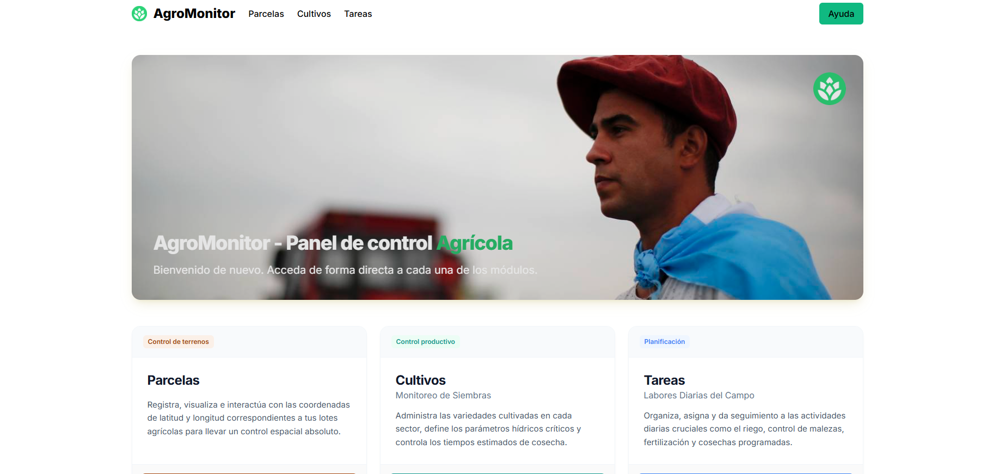
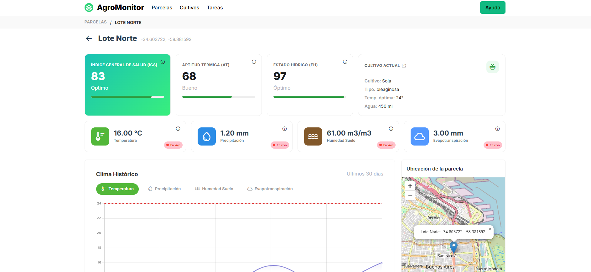
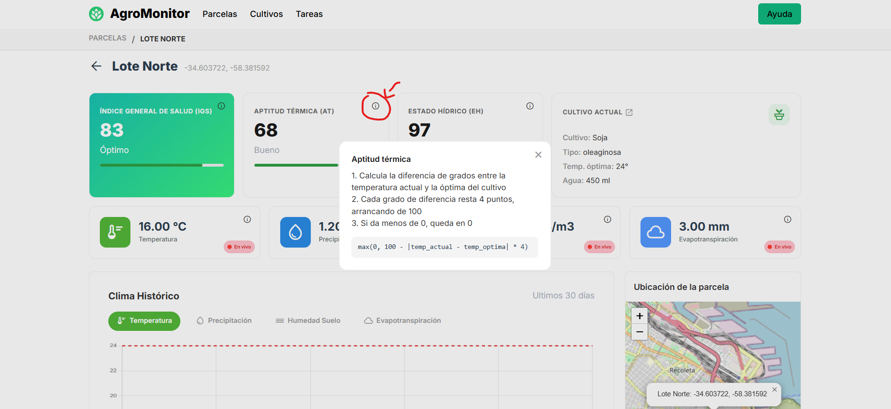
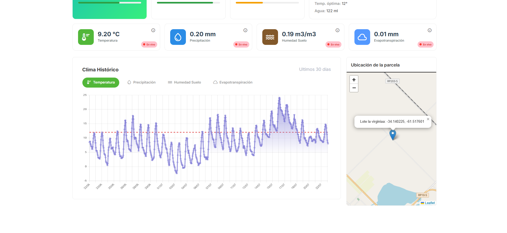
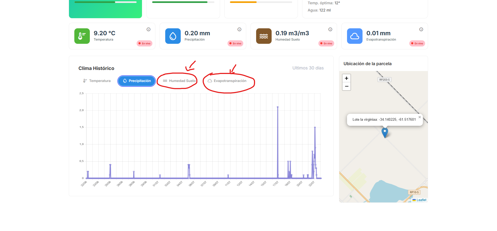
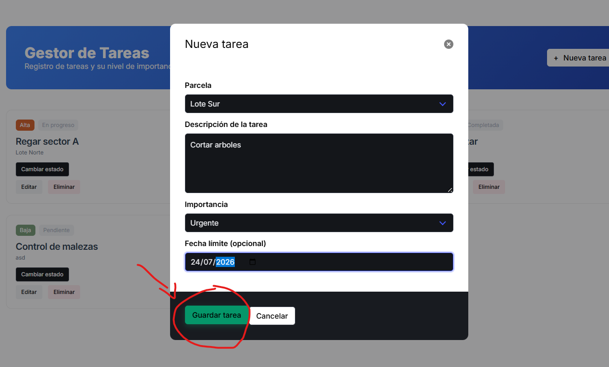
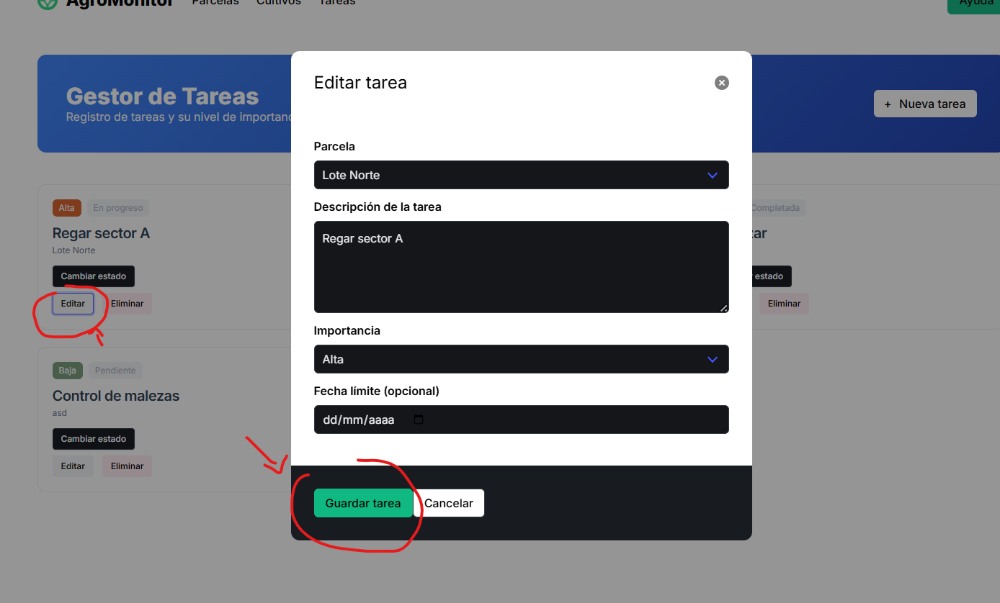
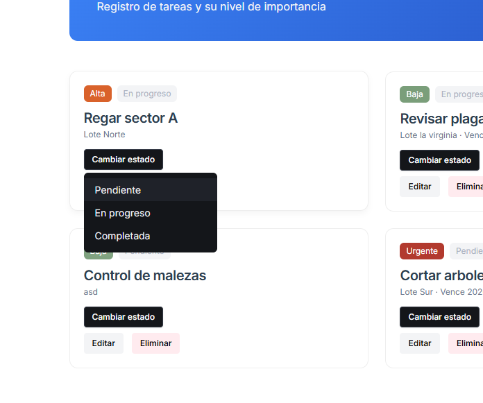
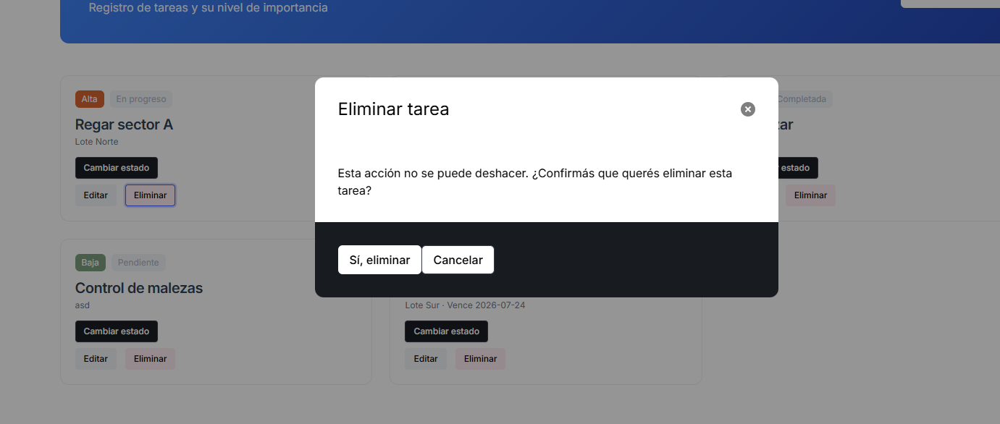
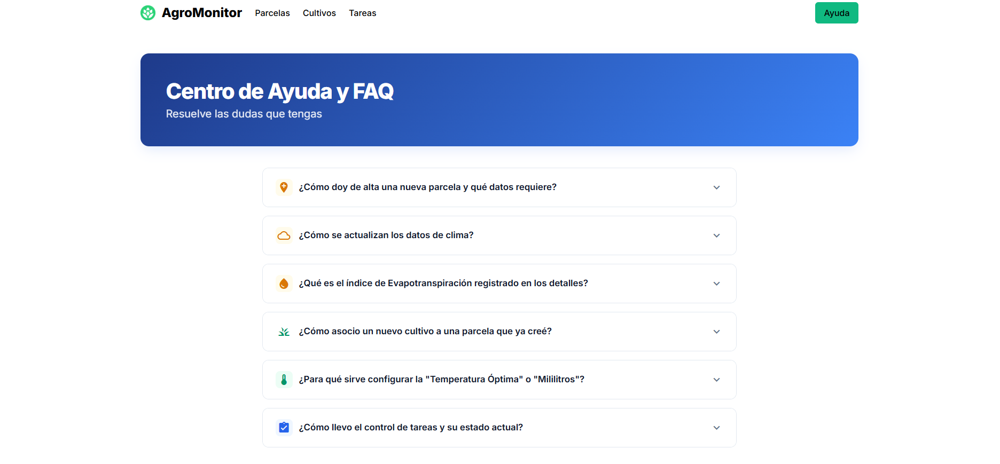

  

  

<h1 align="center">AgroMonitor</h1>
<h3 align="center">El EQUIPO 1</h4>

    <strong>Autores</strong> 
    Rodrigo Berón 115754 
    Tomás Perez 115643 
    Marcos Fortunato 115038

AgroMonitor es una plataforma  gestión y monitoreo de campos agrícolas. La idea central es que el productor agrícola pueda tener, en un solo lugar, toda la información de sus terrenos cruzando por un lado el cultivo que tiene su terreno y por otro las condiciones meteorológicas reales en esa ubicación. Permitiéndole tomar mejores decisiones. 

Concretamente:
1. Registrar sus terrenos.
2. Aignar cultivos a tus terrenos
3. Conocer las condiciones metereológicas actuales y de los últimos 30 días.
4. Evaluar la salud del cultivo mediante un sistema de puntuación (score).
5. Registrar y planificar tareas.

En las **siguientes secciones** desarollamos mas profundamente con ejemplos visuales, cada uno de estos puntos.

## Índice
- [Cómo levantar el proyecto](#cómo-levantar-el-proyecto)
- [Explicación de plataforma con ejemplos visuales](#explicación-de-plataforma-con-ejemplos-visuales)
  - [Parcelas](#parcelas-1)
  - [Cultivos](#cultivos-1)
  - [Detalle de parcelas](#detalle-de-parcelas-1)
  - [Tareas](#tareas-1)

## Cómo levantar el proyecto
1.  cd Proyecto-TP-Final-INTRO
2.  make run (en realidad el make run no builde. cheqeuar esto

Alternativamente:
1. cd Proyecto-TP-Final-INTRO/backend/
2. docker compose up --build

## Explicacación de plataforma con ejemplos visuales
En primer lugar destacamos la página principal del proyecto.

  

A continuación un detalle del todo el resto de las páginas
### Parcelas
Esta es la pantalla principal de la pagina de parcelas.html

  

En ella podemos por un lado crear una parcela. En la que podemos rellenar los siguiente datos:
1. Nombre de la parcela
2. Latitud, longitud
3. Hecareas y subir una imagen

Alterntavimente podemos seleccionar en el mapa la ubicacion de la parcela y el programa automcompleta automaticamente el resto de datos

  

Actualizar la parcela, funciona de la misma manera que crearla.

  

### Cultivos
### Detalle de parcelas
Al entrar a una parcela se ve su detalle. El detalle basicamente contiene 3 componentes

El score, Datos actuales de la temperatura y por ultimo un grafico historico con los datos reales (traidas por una api) de los últimos 30 días.

  

Cada dato y cada score tiene un botón de información que explica qué significa y/o cómo se calcula en el caso de los scores.

  

Debajo se grafica la evolución histórica del clima (temperatura, precipitación, humedad, y evapotranspiración).

  

  

### Tareas
En tareas.html se gestionan las tareas de trabajo de cada parcela. Se pueden crear nuevas indicando parcela, descripción, prioridad y fecha límite.

  

Cada tarea se puede editar.

  

También se puede cambiar su estado (pendiente, en progreso, completada) desde un menú.

  

Y eliminarla, con una confirmación previa.

  

### Ayuda
Por último mencionamos la exitencia de esta página que el usuario accede tocando arriba a la derecha.

  

