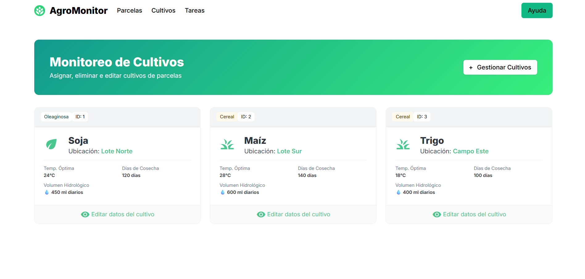
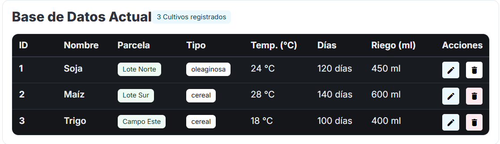
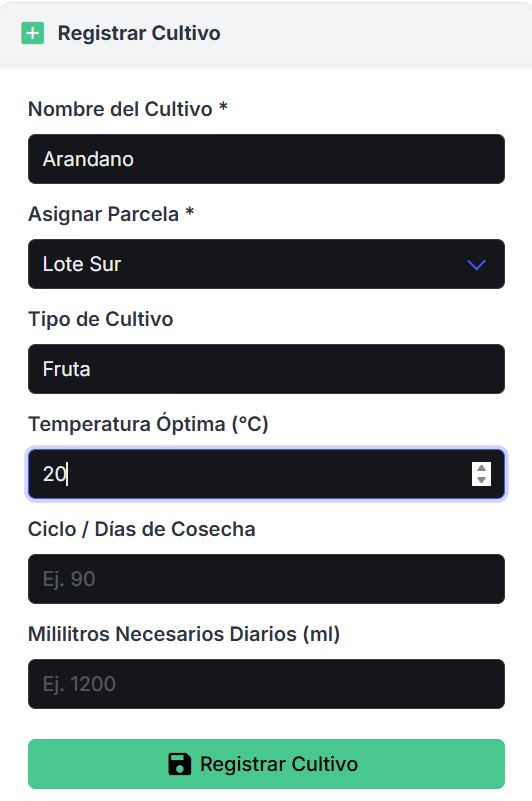
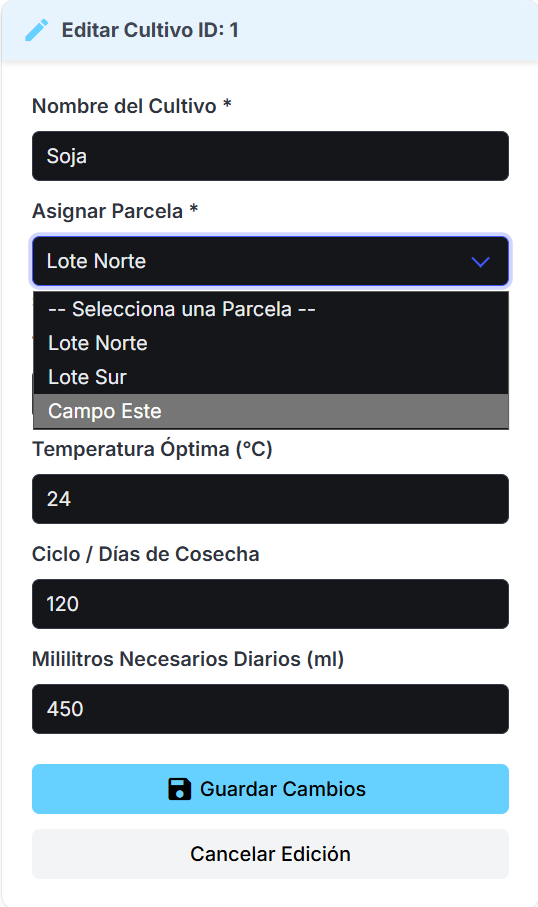

División: Parcela: Rodri
Detalle de parcela: Marcos
Cultivos: Tomi
Main-Docker-Tareas: Ezequiel

## ESQUEMA PARTES
[\[a\](https://excalidraw.com/#room=1e171603359db08b33fe,HzJasG4emjEsQicvmKIE9w)](https://excalidraw.com/#room=1e171603359db08b33fe,HzJasG4emjEsQicvmKIE9w)

## COMO LEVANTAR PROYECTO
1. TENER docker destop abierto
2. cd Proyecto-TP-Final-INTRO
3. Levantar los contenedores: make run
4. Verificar que anda : curl http://localhost:8000/health  

## Tablas

### Parcela:
id
nombre
latitud
longitud
hectareas
imagen

### Cultivo:
id
nombre_cultivo
id_parcela
tipo
temperatura_optima
dias_de_cosecha
mililitros_necesarios

### Detalle parcela:
id
parcela_id
fecha
temperatura
precipitacion
humedad_suelo
evapotranspiracion

### Tareas:
Tareas:
id
parcela_id
tarea
prioridad
estado
fecha_limite

# Funcionamiento

## Cultivos

Dentro de la pagina principal de cultivos es posible observar las principales caracteristicas de cada cultivo, tales como nombre, parcela, temperatura optima, dias de cosecha y mililitros necesarios.
Ademas es posible presionar en editar datos del cultivo para editar directamente un cultivo en especifico o hacer click en gestionar cultivos para elegir claramente entre todos los cultivos o crear uno nuevo

  

Dentro de la pagina de gestion de cultivos se encuentra por la derecha un apartado en el cual se muestran todos los datos de cada cultivo ingresado en la base de datos y la posibilidad de eliminar un cultivo presionando en el icono rojo o la posibilidad de hacer los cambios que quieras presionando el boton azul de edicion

  

Por otro lado para crear un nuevo cultivo existe un bloque a la izquierda que permite rellenar cada campo. Completar nombre y parcela es obligatorio, el resto de campos son opcionales.
Para finalizar la creacion del cultivo se debe presionar en guardar cultivo

  

Finalmente, en caso de seleccionar la opcion de edicion los campos del cultivo seleccionado se rellenaran solos y sera posible editarlos para luego guardar los cambios

  

